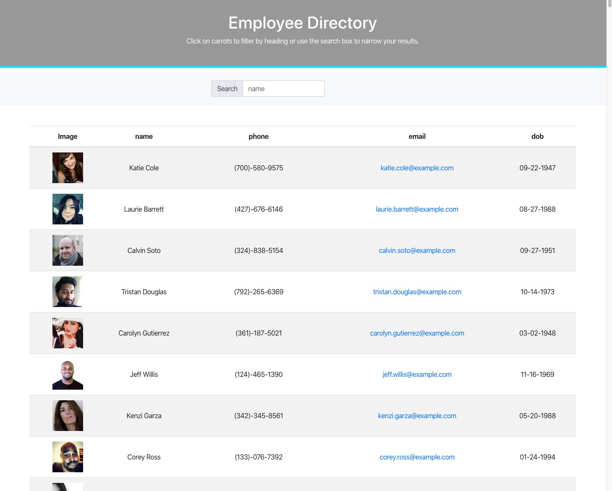

# Project #17: Employee Directory

An application that allows it's users track their employee's information with the ability to search and sort through them so that they can view the employee's information quickly and effectivly.

## Table of Contents

1. [About](#about)
2. [Getting Started](#getting-started)

## About

Employee Directory gives you the ability to view your employee's information at a glance. With the ability to search and sort, you can find that one employee you are looking for.

Currently this application pulls information from a User Generator ([randomuser.me](https://randomuser.me/)) to supply a good amount of 

## Images

Main Page

## Getting Started on your own machine

Clone the application to your local machine:

``
git clone git@github.com:Braydon-Nelson/16-Budget-Tracker.git
``

Prepare the NPM Packages:

``
npm i
``

The application can be with the following command:

``
npm start
``

Start Tracking

## Built With
- [HTML](https://www.w3schools.com/html/)
- [CSS](https://www.w3schools.com/css/)
- [JavaScript](https://www.w3schools.com/javascript/)
- [Bootstrap](https://getbootstrap.com/)
- [Node](https://nodejs.org/)
- [React](https://reactjs.org/)
- [randomuser.me](https://randomuser.me/)

## Live Application

Link to live application - https://braydon-nelson.github.io/17-Employee-Directory/
